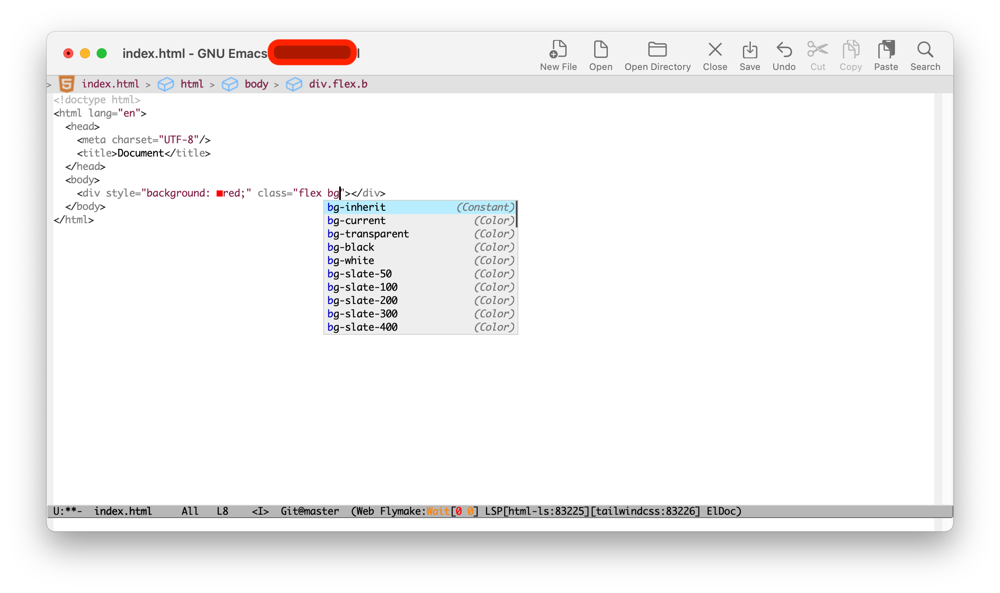

## Emacs LSP Test For TailwindCSS


1. 下载
```
git clone https://github.com/honmaple/test-tailwindcss
```

2. 安装依赖
```
cd test-tailwindcss
npm install
```

3. 修改 `init-test.el`
```elisp
(defvar maple-lsp 'lsp-bridge)
;; (defvar maple-lsp 'eglot)
;; (defvar maple-lsp 'lsp-mode)
```

4. 设置 **lsp-bridge** 的 `load-path`和`lsp-bridge-python-command`
```
(setq lsp-bridge-python-command (expand-file-name "versions/lsp-bridge/bin/python3" (getenv "PYENV_ROOT")))
```

5. 测试
```
emacs -Q --load init-test.el
```

目前只有 **lsp-mode** 的补全生效
